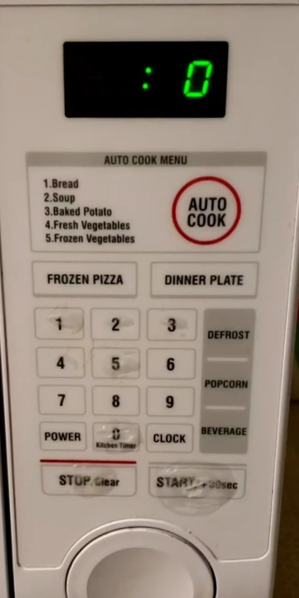
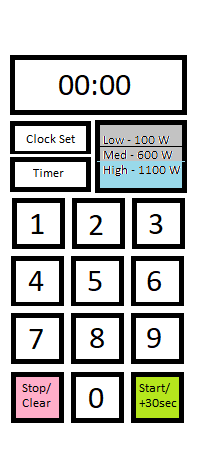
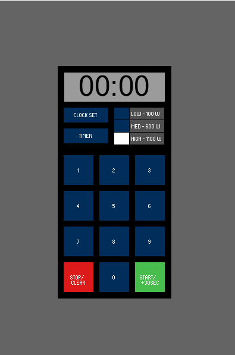

# Christopher Bednarz - CS 4331 - Project 1

# Description

This is a touchscreen interface for a microwave, first showing an example of a bad one and then an example of a good one.

## Project link
(Project 1 - Microwave Interface) (https://thetomzest.github.io/p1ChristopherBednarz/)

## Problems with Current Microwave
The microwave I've chosen to critique is an old one that came with a friend's apartment. In general, the microwave works well and there's not many problems relating to its main use case. However, the design is similar to many other microwaves in which there's functions that are never used.

Why are there multiple options for auto cook, yet we still have options for frozen pizza, dinner plate, popcorn and beverages? Having both options is redundant and they should all either be buttons or available in the menu. When pressing these buttons, what does the number represent? Without any manual, there's no information as to what these numbers represent. Nor is there any indication of which functions use some sort of sensing technology to determine when the food is done. It is also quite annoying that the microwave starts automatically after entering these options, not giving much time to adjust the settings. Finally, once the user enters the time to cook, the power option is unavailable, but why this happens is not clear to the user.

## Microwave Usage

The most common usage of a microwave is to heat up food for a certain amount of time, sometimes at different amount of power levels. The other functions, which as seen in the picture above in their levels of wear compared to the time options, are almost never used. The most common sequence of events is entering a time and then hitting start, so these should be the most easily accessible and intuitive. Microwaves typically respond to users with feedback in the form of beeps and visual feedback on the screen. Microwaves with a start button are passively conveying information to the user as well, that once the user has entered the desired settings, they should press start to begin heating the food.

## New Design

For the new design, it will be very simple, only containing a numpad, start button, stop button, a power selector, timer, and clock set, along with a screen displaying the time. By keeping the design to the bare essentials, this keeps all superfluous functions to a minimum while making sure that the main function of heating food is straight forward and works as the user would expect.

